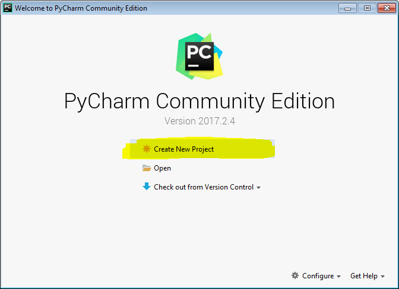
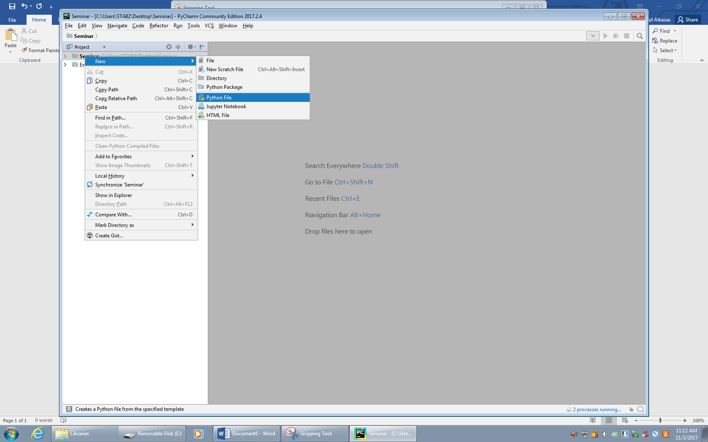

.. _PythonGeneralPythonSetup:

Python Setup
""""""""""""
Purpose
'''''''
The purpose of this tutorial is to describe how to setup up Python for the first time, and run a simple ``hello_world`` script.

This tutorial first describes what :ref:`software<PythonGeneralPythonSetupSoftware>` to download and install. This section will offer a brief explanation of the packages and their purpose. 

The :ref:`PythonGeneralPythonSetupFirstScript` describes opening the IDE, writing and executing a simple ``hello_world`` scipt.

The :ref:`PythonGeneralPythonSetupWorlflow` describes a general use and organization of the IDE.

.. _PythonGeneralPythonSetupSoftware:

Software
''''''''
There are two (free) packages that you should download and install in the following order: 

    #) Anaconda (`<https://www.anaconda.com/distribution/>`_). This is a Python distribution.
    #) PyCharm - Community (`<https://www.jetbrains.com/pycharm/download>`_). This is an integrated development environment (IDE).

The Python distribution includes the Python software, along with additional packages. Anaconda is recommended because it includes several scientific packages. Installing a Python distribution is recommended because installing individual Python packages/modules can be tedious.

The IDE is the software that is used to write code. This is the software that you will interact with when writing and executing code. By analogy, Python is to the english language as an IDE is to Mircosoft Word. You can technically write Python code in a simple text editor such as *gedit* or *notepad*, but an IDE offers several features that make life easier. If you use a simple text editor to write code, then your code will be bad and you will be a bad person.

Both Anaconda and PyCharm are larger packages and installations. Experienced users may opt for a more lightweight Pthon distribution and IDE.

.. NOTE:: When installing Anaconda, you may get this step. Check the box *Add Anaconda to my PATH environment variable* if you are unfamiliar with the use of the PATH environment. Experienced users can decide if they want to add Anaconda to their path during the installation, or at a later time.

    .. figure:: ../img/General/PythonInstallWizard.png
        :width: 300px
        :align: center
        :alt: alternate text
        :figclass: align-center

    Also note, if you are using a Windows machine, Anaconda may install to this path: ``C:\Users\User-Name\AppData\Local\Continuum\Anaconda3\Scripts\anaconda.exe``

.. _PythonGeneralPythonSetupFirstScript:

First Script
''''''''''''
This section describes opening PyCharm for the first time, and writing a simple ``hello_world`` script.

These steps describe the first time opening PyCharm, and this is not the usual procedure for regular use. See the :ref:`PythonGeneralPythonSetupWorlflow` for the description of regular usage.

1) Open PyCharm
***************
* If you are using a windows machine, then go to the ``Start Menu > Jetbrains > PyCharm``
* If you are using linux, open a terminal and navigate to the ``PyCharm_install_directory/bin`` then enter the command ``./pycharm.sh``. You will do this for the first time you open PyCharm, then once you have it open, go to the top bar ``Tools > Create Desktop Entry``. This allows you to open PyCharm from the *Applications* menu.

2) Create A Project
*******************
* Advance through the few popups, and select the default options.
* Create a project directory somewhere on your computer

In the normal :ref:`workflow<PythonGeneralPythonSetupWorlflow>`, you will organize relevant code in a directory. You will make this directory the *Project*. A project is more relevant for regular usage, where you will have multiple python scripts that are somewhat related. In this case it makes sense to organize those related scripts in directories under one *Project*. However, for this example, there will only be one script, so you will likely delete the project once you are finished.

3) Create the hello_world script
********************************
* PyCharm may take a while to load the first time you open it. Your computer is likely thinking about all of all the decisions that have lead to this point in its life, and it is suggested that you do the same. 
* Once PyCharm has opened, ``Right click the project name > New > Python File``
* Give the file the name ``hello_world``

* In the open file, enter the following code:

.. code-block:: python

    print("Hello World!")

* Run the script: ``Right click in the editor > Run 'hello_world'``
    You should see ``Hello World!`` print in a window.

.. NOTE:: If the script did not run, try the following:

    * Navigate to: ``File > Settings > Project: *name* > Project Interpreter``
    * Click the gear icon in the upper right corner, then *Add...*
    * Select ``System Interpreter`` and click the ``...`` button.
    * Select the *python* file, which may be located somewhere similar to this: ``C:\Users\User-Name\AppData\Local\Continuum\Anaconda3\bin\python``
    * Click ``Apply`` and close the settings window.
    * PyCharm will likely take some time, so wait a few minutes...
    * When PyCharm is done loading/indexing the python distribution, try running the script again: ``Right click in the editor > Run 'hello_world'``

.. _PythonGeneralPythonSetupWorlflow:

Workflow
''''''''
In daily use, you will open PyCharm, and the last project you had open will load. From there you can execute and create new Python files, or other types of files. You can create documentation similar to the one you are reading now.

*Whatever you do in PyCharm, you do that in the context of a project. A project is an organizational unit that represents a complete software solution.* `PyCharm Documentation <https://www.jetbrains.com/help/pycharm/creating-and-managing-projects.html>`_

For example, if you get a new work assignment, you may create a new directory and organize that assignment's files in that directory. A project can be that high level directory you created for the assignment. The only thing that differentiates a directory from a project is that a project contains .idea file that PyCharm creates. A project can (and likely will) contain files that are not Python scripts. This makes it easy to organize and manage files from PyCharm.